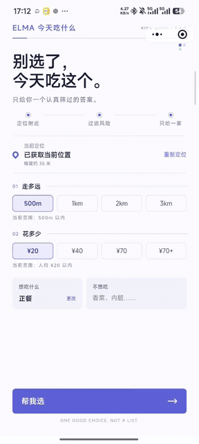

# ELMA · 今天吃什么

一个帮用户从附近餐厅中做决定的微信小程序。

微信搜一搜：饭点电波。

它解决的不是“附近有什么”，而是“条件都差不多时，到底选哪一家”。用户给出距离、预算、餐饮类型和不想吃的内容，服务端筛选附近餐厅，最终只返回一个主要选择；如果不满意，可以在同一轮候选中换一家，也可以用反馈逐步调整后续推荐。

## 产品演示

<p align="center">
  
</p>

<p align="center"><sub>从条件筛选到推荐结果与按需深挖</sub></p>

<p align="center">
  
</p>

<p align="center"><sub>微信搜一搜“饭点电波”体验小程序</sub></p>

## 用户实际会怎么用

1. 授权当前位置，按需要调整距离、预算、品类和“不想吃”。
2. 查看一家餐厅及其推荐理由、风险说明和跨平台信息摘要。
3. 选择“就它了”、打开地图、跳过，或在最多 5 个备选中换一家。
4. 提交三态反馈和可选口味标签；需要时主动“深挖一下”，也可以删除当前匿名身份关联的数据。

## 四个值得展开的设计点

1. **一次推荐是一段冻结的决策过程。** 高德 POI 经过餐饮身份校验、硬条件过滤、风险评估和个性化排序后，生成最多 6 家候选。候选、分项得分、随机种子和选择前快照一起保存，reroll 不重新查询或重排。
2. **餐厅风险和用户口味分开建模。** Risk 只表达餐厅的客观风险；TasteProfile、行为和近期饮食历史只影响推荐排序。用户不喜欢一家店，不会反过来把这家店标成“客观高风险”。
3. **第二数据源不是简单拼字段。** 高德是主餐厅来源，百度只作为可降级的结构化 Evidence。两边门店要经过名称、坐标、地址和电话的一对一匹配；无匹配、歧义或百度不可用时，主推荐仍可继续。
4. **匿名不等于不管理数据。** 项目不要求登录，但提供隐私说明和数据删除接口。用户可以删除推荐会话、行为、反馈、近期历史和画像，同时保留不属于个人的共享餐厅与 Evidence。

## 1. 从列表排序到单一决策

如果只按评分降序，用户依然要比较距离、预算、品类和可信度。项目因此把一次推荐拆成了清晰的数据链路：

```text
附近 POI
→ 餐饮身份与硬条件过滤
→ 结构化 Evidence 与客观风险
→ 质量 / 风险 / 口味 / 预算 / 距离 / 近期多样性
→ 剔除 HIGH 风险
→ 低风险范围内的受限探索
→ 最多 6 家冻结候选
→ 首次推荐与最多 5 次换一家
```

随机性只出现在最终候选选择阶段，并受到风险与负偏好约束。服务端保存随机种子、排序前快照和候选分项，因此可以复盘某次推荐，而不是只能看到一个无法解释的最终结果。

这套逻辑的目标是减少明显不合适的选择，不代表已经用线上指标证明了“最优推荐”。

## 2. 把客观风险和主观偏好隔离

`risk-v0.3.1` 根据地图信息完整度、跨平台评分差异和可选评论 Evidence 生成风险分数、置信度与理由。当前实时偏好版本 `taste-v0.2` 则从显式反馈、轻量行为和近期饮食历史形成匿名偏好；历史会话仍保留并返回其实际落库版本。风险与口味在领域模型和持久化快照中保持分离，直到 `recommendation-v0.4.1` 排序时才组合。

这里有两个刻意保留的限制：

- 新用户和少量行为会向中性偏好收缩，避免一次点击就大幅改变推荐。
- 当前会话创建后保持冻结，后续反馈只影响下一次新推荐，不偷偷改写剩余 reroll 顺序。

这更接近一个可解释的规则闭环，而不是“猜你喜欢”的黑盒模型。

## 3. 处理外部地图数据的不确定性

同一家门店在不同地图平台上的名称、地址和坐标可能不完全一致。项目先把第三方字段转换为平台无关模型，再通过名称、距离、地址和电话计算匹配；分数接近时标记为歧义，同一百度门店也不能在一个批次中匹配多家高德餐厅。

百度 Evidence 有独立缓存和有效期。请求失败、没有结果、无法匹配或字段缺失时，系统记录真实状态并降低置信度，不把“没有第二来源数据”等同于餐厅有问题，也不让百度故障拖垮高德主推荐。

用户主动点击“深挖一下”时，系统才通过 Brave Search 读取 B站、小红书和大众点评的公开索引标题、链接与摘要。它不登录平台、不读取评论区，结果只作为独立弱线索展示，不改变主排序、候选池、TasteProfile 或 reroll。

## 4. 给匿名数据一个完整生命周期

客户端首次启动时生成匿名 UUID，用它关联推荐会话、反馈、行为、近期饮食历史和 TasteProfile。它用于数据归属，不等同于登录、鉴权或跨设备账号。

隐私页面解释位置和匿名数据的用途，并提供 `DELETE /api/v1/users/me/data`。后端按外键关系删除该 UUID 关联的个性化数据，客户端随后清除本地 UUID 和当前推荐状态；共享餐厅、风险结果和地图 Evidence 不随单个用户删除。

## 代码如何对应这些设计

- `RecommendationService`：编排 POI 召回、过滤、Evidence、风险、排序、候选冻结和反馈。
- `DefaultRecommendationEngine`：高风险剔除、个性化排序、有限探索和确定性选择重放。
- `EvidenceAggregator` / `EntityResolver`：百度批量 Evidence、跨平台门店匹配、缓存与降级。
- `TasteProfileService` / `BehaviorService`：显式反馈、幂等行为和受限的长期偏好更新。
- `DeepEvidenceService`：只在用户主动触发时生成独立公开线索判断。
- `UserDataDeletionService`：删除匿名用户数据，保留共享餐厅和 Evidence。
- `contracts/openapi.yaml`：推荐、reroll、反馈、行为、深挖和数据删除接口的事实源。

## 技术栈

- 客户端：uni-app、Vue 3、TypeScript、Vitest
- 服务端：Java 17、Spring Boot 3.5、Spring Data JPA、Flyway
- 数据：PostgreSQL、Caffeine 进程内缓存
- 外部服务：高德 Place、可选百度 Place、按需 Brave Search
- 契约与验证：OpenAPI 3.0、JUnit 5、Vitest

## 本地运行

前端要求 Node.js 22 和 pnpm 11：

```powershell
pnpm install
Copy-Item .env.example .env.local
pnpm dev:mp-weixin
```

在微信开发者工具中导入 `dist/dev/mp-weixin`。后端需要 Java 17 和 PostgreSQL：

```powershell
mvn -f backend/pom.xml spring-boot:run
```

数据库、高德、百度和 Brave 的环境变量见 [`backend/README.md`](backend/README.md)。所有真实密钥只通过环境变量注入，不进入前端代码或仓库。

## 验证

```powershell
pnpm typecheck
pnpm test:run
pnpm build:mp-weixin
py contracts/validate_openapi.py
mvn -f backend/pom.xml test
```

测试覆盖推荐与探索边界、候选重放、画像收缩、实体匹配、跨平台风险、外部服务降级、缓存、幂等行为、数据删除接口，以及小程序的主要页面交互。完整后端接口测试需要可连接的 PostgreSQL 测试库。

## 当前边界

- 推荐、风险、画像和深挖均为规则实现，尚未使用机器学习，也没有线上 A/B 实验证明推荐效果。
- 匿名 UUID 不提供登录、权限系统或跨设备画像同步。
- 跨平台匹配依赖有限字段与阈值，仍可能出现未匹配或歧义，系统选择显式降级而不是强行合并。
- Brave 深挖依赖公开搜索索引，只能作为辅助线索，不能代表平台完整评价。
- 步行时间按距离估算，不是实时路线规划结果。
- 外部地图 API 的配额、字段缺失和覆盖范围仍会影响候选完整度。

## 项目结构

```text
src/                         微信小程序前端
backend/src/main/java/       Spring Boot 模块化单体
backend/src/main/resources/  配置与 Flyway V1–V8
contracts/openapi.yaml       前后端接口契约
tests/                       前端测试
docs/                        版本设计、算法审计与发布说明
```

更多版本事实见 [`docs/releases/v1.0.0.md`](docs/releases/v1.0.0.md)。

## 许可证

本项目采用 [MIT License](LICENSE)，版权所有 © 2026 elma。
